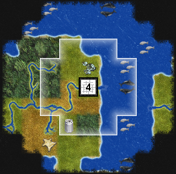

webciv.js
=========



A Strategy Game Engine in JavaScript:

  * [Official Repository (kobalicek/webciv)](https://github.com/kobalicek/webciv)
  * [Official Chat (gitter)](https://gitter.im/kobalicek/webciv)
  * [MIT Licensed](./LICENSE.md)

This is a work-in-progress "toy" project. Nothing serious at the moment. The game logic actually happens on the client and the server is just used to serve the content. To run the server run the following and use web browser to access `localhost:8001`:

```sh
$ node server
Listening on port 8001
```

Demo application is available [here](https://kobalicek.com/webciv)
